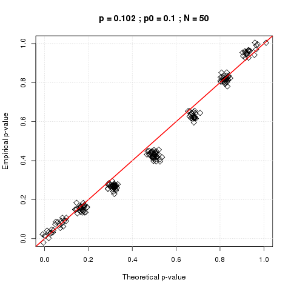
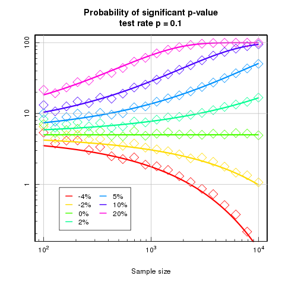

# ab-testing

## Description of the question

Let's consider an experiment in which we are observing a  sequence of `N` **independent** Bernoulli trials 
(whose probability of success is assumed to be constant but unknown).  For the sake of simplicity, we measure the performance
of this experiment by monitoring an empirical success rate defined as the ratio: `number of successes / N`.  Let's 
imagine that (through previous experience) we are already aware of some baseline success rate `p0` and that we 
would like to compare the performance of our current experiement with respect to the baseline.  

This scenario is actually quite ubiquitous as it appears in all kinds of systems optimization ranging from early 20th century beer tasting (the [historical origin](https://en.wikipedia.org/wiki/William_Sealy_Gosset) of scientific AB tests by William Sealy Gosset at the Guinness Brewery) to modern day marketing and business intelligence running at scale all over the internet.

The traditional technique consists in calculating a p-value quantifying the statistical significance of the difference 
between the success rate observed experimentally and the baseline.  Namely, if the p-value is less than 0.05, the usual conclusion would be that the experiment is performing significantly better than the baseline.  One should note that even though
p-values continue to play a significant role in the scientific literature, [doubts have started to emerge](http://journals.plos.org/plosmedicine/article?id=10.1371/journal.pmed.0020124) recently regarding their trustworthiness especially with regards to the factual conclusions of many research studies.

The objective of this note is to dig a little deeper and expose one aspect in which p-value interpretation may be more complicated than it would seem at first sight.  Namely, we will show how finite size effects may play a very important role forcing us to rethink the validity of the method defined above.

In order to make some sense, let's consider the ideal situation in which we know the true underlying 
success rate `p*` of the Bernoulli trials.  Picking any `p* > p0` guarantees that the experimental observation
is **by construction** better than the baseline.  However, any real life experimental realization can only consist of a finite number `N` of trials.  This means that the empirical success rate `p` is actually a random variable with a Binomial distribution of mean `p*` that has a finite standard deviation decreasing as `1 / sqrt(N)`.

As a consequence, the p-value also becomes a random variable (whose probability distribution we will investigate further) that
depends on `p*`, `p0` and `N`.  The natural question then becomes: "Given `p*` and `p0`, how many events `N` do we need to observe
before we can say that the probability to observe a significant p-value is more than 95%?"  

In other words: keeping in mind that since we chose `p* > p0`, it is guaranteed that the experiment is better than the baseline
but the interesting question is about how long it takes before we can see this with 95% certainty for given values of `p*` and `p0`.  


## Intuitive description of the p-value

Given the assumptions described above, the standard way to investigate statistical significance of the difference between the empirical success rate `p` and the baseline rate `p0` is to apply the so-called "one-proportion z-test":
<p align="center">

</p>
where the p-value is obtained by using the cumulative distribution function (CDF) of the standard normal distribution.

In order to gain some simple insight into the meaning of this theoretical p-value, we can try to define our own version of the p-value.  Let's start from our experiment consisting of a single empirical realization of `N` Bernoulli trials with average success rate `p`.  In order to to see how statistically strong the difference between `p` and `p0` is, we can use the bootstrap technique (sampling with replacement) in order to generate many new random realizations of our experiment and simply measure how many of these random samples lead to an observed success rate lower than `p0`.  In other words, we are measuring what is the probability that the experiment would actually be worse than the baseline rate;  this probability precisely defines the p-value. 

As you can see in the plots below, both definitions of the p-value are in excellent agreement with each other.
```
Rscript pValueComparator.R --successRate 0.102 --testRate 0.1 --numberOfEvents 2500
```

<p align="center">


</p>

In addition to being (maybe) more intuitive, note that this definition is also completely free of whatever assumptions would be required in order to derive the standard theoretical  test.

## Finite size effect & statistical significance

Thanks to the calculations presented in the [additional material](doc/ab-significance.pdf) , we are now in a position to predict what is the probability of observing a significant p-value for given values of `p* ; p0 ; N`.  As one can see in the plot below, the numerical results (points) are in very good agreeement with the theoretical predicions (continuous lines corresponding to Equation 6 in the additional material).

<p align="center">

</p>

How to read this graph? (produced by the command below)
```
Rscript convergenceRate.R
```

For simplicity, let's start by considering the special case when the true success rate is equal to the baseline rate `p* = p0`.  In this case, the probability of observing a significant p-value is equal to 5% regardless of the sample size as expected.  In other words, there is only a 5% chance of concluding that the empirical data is better than the baseline rate even though we know that they are actually identical to each other.

Let's now consider the case where `p* = 0.11`; a whopping 10% increase compared to a baseline rate of `p0 = 0.1`.   Unfortunately, we can see that if you run the experiment for 1,000 events (not such a small sample size in practice), there's only a 30% chance that the p-value you would get would reveal the experiment as significantly better than the baseline.  In other words, there's a 70% chance that the p-value would lead you to discard the experiment as not significantly better even though we know for a fact that it is.  In order to have a 95% confidence that the p-value would be significant, one would need to wait until about 10,000 events.  For a more realistic situation in which there is only a 0.5% increase compared to the same baseline rate, one would need to wait for about 4,000,000 events before reaching significance...

Note that the same analysis can also be carried out for situations in which the experiment is known to be worse than the baseline `p* < p0`.  For example, let's consider `p0 = 0.1`,  `p* = 0.096` and `N = 1000`.  Despite the fact that the experiment is constructed to be 4% worse than the baseline and that we observed 1,000 events, there is still an almost 2% chance that we may conclude the experiment to be statistically (but wrongly) better.

## Take home message

With many changes happenning quasi-simultaneoulsy, all of which with some varying degrees of correlations with each other (deployment of new features, seasonal changes, special case scenarios...), real world hypothesis testing is always a tricky topic.  Reaching any decision with some degree of confidence is a particularly thorny adventure.  Here, we considered the ideal situation in which everyting is uncorrelated, stationary and known in advance.  The only question is about the number of observations one needs to wait in order to be able to draw the correct conclusion.  Surprisingly, the rate of convergence towards the truth is remarkably slow indicating that finite size effects may be one the most important factor when analyzing the significance of AB tests. 

The road ahead?  Generalize same analysis to two-tailed tests...
