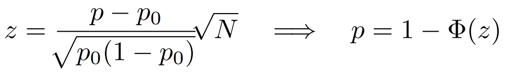
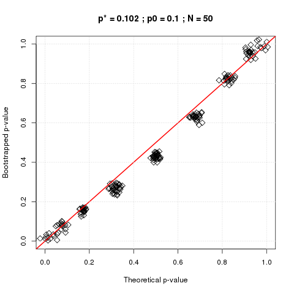
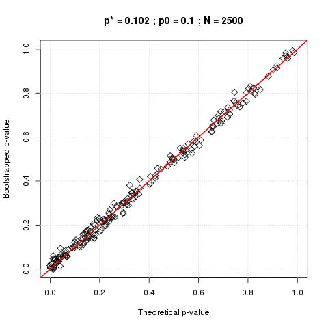

# ab-testing

## Objective

Let's consider an experiment in which we are observing a  sequence of `N` **independent** Bernoulli trials 
(whose probability of success is assumed to be constant but unknown).  For the sake of simplicity, we measure the performance
of this experiment by monitoring an empirical success rate defined as the ratio: `number of successes / N`.  Let's 
imagine that (through previous experience) we are already aware of some baseline success rate `p0` and that we 
would like to compare the performance of our current experiement with respect to the baseline.  

The situation described above is quite ubiquitous in systems optimization ranging from ... to ...

The traditional technique consists in calculating a p-value quantifying the statistical significance of the difference 
between the success rate observed experimentally and the baseline.  Namely, if the p-value is less than 0.05, the usual conclusion
would be that the experiment is performing significantly better than the baseline.

The objective of this note is to dig a little deeper and expose the fact that finite size effects play a very central role forcing us to rethink the validity of the method  defined above.

In order to make some sense, let's consider the ideal situation in which we know the true underlying 
success rate `p` of the Bernoulli trials.  Picking any `p > p0` guarantees that the experimental observation
is **by construction** better than the baseline.  However, any real life experimental realization can only consist of a finite number `N` of trials.  This means that the empirical 
success rate is actually a random variable with a Binomial distribution of mean `p` that has a finite standard deviation decreasing
as `1 / sqrt(N)`.

As a consequence, the p-value also becomes a random variable (whose probability distribution we will investigate further) that
depends on `p`, `p0` and `N`.  The natural question then becomes: "Given `p` and `p0`, how many events `N` do we need to observe
before we can say that the probability to observe a significant p-value is more than 95%?"  

In other words: keeping in mind that since we chose `p > p0`, it is guaranteed that the experiment is better than the baseline
but the interesting question is about how long it takes before we can see this with 95% certainty for given values of `p` and `p0`.  

## Intuitive description of the p-value

Given the assumptions described above, the standard way to investigate statistical significance of the difference between the empirical success rate `p` and the baseline rate `p0` is to apply the so-called "one-proportion z-test":

where the p-value is obtained by using the cumulative distribution function (CDF) of the standard normal distribution.

In order to gain some simple insight into the meaning of this theoretical p-value, we can try to define our own definition of the p-value.  Let's start from our experiment consisting of a single empirical realization of `N` Bernoulli trials with average success rate `p`.  In order to to see how statistically strong the difference between `p` and `p0` is, we can use the bootstrap technique (sampling with replacement) in order to generate many new random realizations of our experiment and simply measure how many of these random samples lead to an observed success rate lower than `p0`.  In other words, we are measuring what is the probability that the experiment would actually be worse than the baseline rate;  this probability precisely defines the p-value. 

As you can see in the plots below, both definitions of the p-value are in excellent agreement with each other.

In addition to being (maybe) more intuitive, note that this definition is also completely free of whatever assumptions would be required in order to derive the standard theoretical  test.

## Finite size effect & statistical significance

How to read this graph?  Let's consider the case where the experimental rate is 0.115 as an example.  Notice that this represents a whopping 15% increase compared to the test rate of 0.1.   However, we can see that if you run the experiment for 1000 events (not such a small sample size in practice), there's only a 50% chance that the p-value you would get would reveal the experiment as significantly better than the baseline.  In other words, there's a 50% chance that the p-value would lead you to discard the experiment as not significantly better even though we know for a fact that it is.  In order to have a 95% confidence that the p-value would be significant, one would need to wait until more than 3000 events *(TODO: find the exact number by integrating the PDF of p-values)*

